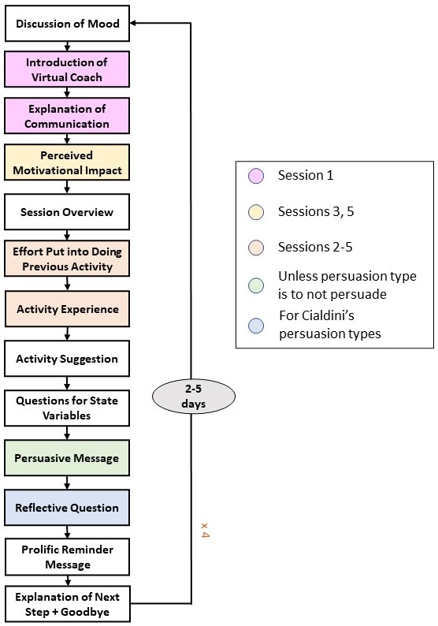

# Reinforcement Learning-based Persuasion for a Conversational Agent to Support Behavior Change

This is the code for the conversational agent Sam that acts as a virtual coach and suggests preparatory activities for smoking cessation and becoming more physically active in five separate sessions. This conversational agent was used in a longitudinal study with more than 500 participants with the goal of gathering data for and testing a personalized reinforcement learning (RL)-based persuasion algorithm. The study was run on the online platform Prolific.

## Experiment Flow

- Recruitment in Prolific
- Pre-screening
- Pre-questionnaire
- Five conversational sessions
   - Sessions 1-2: People are persuaded based on a randomly chosen persuasion type.
   - Sessions 3-5: After session 2, participants are  assigned to one of four groups or experimental conditions. Based on their group, they are then subsequently persuaded by:
      1) a persuasion type with the highest effort score, 
	  2) a persuasion type with the highest effort score in their state, 
	  3) a persuasion type with the highest Q-value in their state, and 
	  4) a persuasion type with the highest similarity-weighted Q-value in their state.
- Post-questionnaire

Please refer to our [OSF pre-registration](https://osf.io/k2uac) for more details on our experiment.

## Dialog Flow

The figure below visualizes the structure of the five conversational sessions.

## System Architecture

### Frontend
The frontend is a simple html-page that makes use of [Rasa Webchat](https://github.com/botfront/rasa-webchat) 0.11.12.

It is expected that the user ID is provided as a URL-parameter, e.g. http://<IP_address>:5005/?userid=JohnDoe if the frontend is running on port 5005. This user ID is extracted and sent to the backend to link multiple sessions of the same user.

Files:
- index.html: html-page if the conversational agent runs locally. The starting intent is defined via the paramter `initPayload`. Set `initPayload = "/start_session1"` to start the first conversational session, `initPayload = "/start_session2"` to start session 2, etc.
- Frontend: contains the html-pages for the 5 sessions if the conversational agent runs on a server. The frontends are run within Docker containers. This folder also contains the necessary Dockerfile. After building a Docker image for a frontend, a Docker container can be run via `docker run -d -p <port, e.g. 5005>:80 <imageName>`.
- connectors: contains the file "socketChannel.py." This file is needed to connect the frontend to the backend.

### Database

An sqlite database (sqlite3) is created within the custom action container. The database initialization script is in the "db_scripts"-folder and can be run via `python init_db.py` from within the running custom action container. This will create the database ":/tmp/chatbot.db" in the container.

There are several custom actions (in "actions.py") that read/write from/to this database.

Please note that the database is destroyed if one stops the custom action container, e.g. via `docker-compose down`. To save the database beyond the lifetime of the custom action container, copy it outside the container before stopping the container.

### Backend

The main component is a conversational agent trained in Rasa 2.0.2.

Files:
- actions: custom actions, e.g. to read from a database.
- models: contains trained models.
- config.yml: configuration for the training of the agent.
- data: contains files to specify e.g. the stories on which the agent is trained.
- domain.yml: utterances, slots, etc.
- endpoints.yml: defines the endpoints of the conversational agent. 

## Other Components

### Group Assignment

In sessions 3-5, participants' assignment to experimental conditions or groups is read from the file "assignment.csv." Since this file was based on people's Prolific ID, the file is not provided here. The experimental condition determines which algorithm level is used to choose a persuasion type in sessions 3-5. The file "group_split_KL.py" shows how participants were assigned to groups after session 2. For details on our randomization, please refer to the section "Randomization" in our [OSF pre-registration](https://osf.io/k2uac).

### Persuasion

There are multiple components to persuading people to do their suggested preparatory activities:
- In each session, a persuasion type is chosen. There are 5 persuasion types (commitment, consensus, authority, action planning, no persuasion). Persuasive messages for the first 4 persuasion types differ based on the preparatory activity they are used for. Moreover, there are multiple different messages for each combination of persuasion type and preparatory activity. All persuasive messages are in the file "all_messages.csv."
- In the case of the commitment, consensus and authority persuasion types, a person is asked a reflective question after the persuasive message. These reflective questions are given in the file "reflective_questions.csv."
- After each session, people receive a reminder message in Prolific. This message contains the formulation of the assigned activity, as well as a reminder question that depends on the persuasion type. All reminder questions can be found in the file "all_reminders.csv." The templates for the reminder messages for the first 4 and the last session are in the files "reminder_template.txt" and "reminder_template_last_session.csv," respectively. There are also templates for these messages in case no persuasion is given. Sending these reminder emails requires the file "email.txt" that contains the email address from which the reminder messages are to be sent.
- In sessions 3-5, persuasion types are chosen based on different persuasion algorithm levels. The files required to train these algorithm levels are in the folder "Post_Sess_2:"
    
	- Compute_Opt_Policy_Level_1.py: Compute the optimal policy for the first algorithm level, which means to choose a persuasion type with the highest overall average effort score.
	- Compute_Opt_Policy_Level_2.py: Compute the optimal policy for the second algorithm level, which means to select a persuasion type with the highest effort score in a person's state. 3 features are chosen to define a person's state.
	- Compute_Opt_Policy_Level_4.py: Compute the optimal policy for the fourth algorithm level, which means to select a persuasion type with the highest similarity-weighted Q-value in a person's state. 3 features define a person's state.
	- extract_data_post_sess_2.py: Extract the data from the database needed to train the algorithm levels. We used data gathered in sessions 1 and 2 as training data.
	- extract_data_prolific_pre-screening_and_qualtrics_pre-questionnaire.py: Extract people's gender identity, big-5 personality, and Transtheoretical Model (TTM)-phase for becoming more physically active from the demographic data export from Prolific and the Qualtrics export from the pre-questionnaire. These variables are needed both for the group assignment and for the computation of the optimal policy for the fourth algorithm level.
	- extract_data_rasa_attention_checks_passing_sessions.py: Determines for each session if people have failed too many attention checks, so that those people are not invited to the next session.
	- G_algorithm_feature_selection_All_Blocks_Exact.py: Feature selection and optimal policy computation for the third algorithm level, which means to choose a persuasion type with the highest Q-value in a person's state.
    - Utils.py: Some general functions.
	
	
### Preparatory Activities

The preparatory activities are provided in the files "Activities.csv"/"Activities.xlsx." These files contain formulations of the activities for different places in the sessions. E.g. there is a different activity formulation for the reminder message that people receive in Prolific and the session itself. An example of an activity is to think of, write down and rank reasons for quitting smoking.

### Running the Agent on a Server with Rasa X and Docker

In our experiment, we hosted the conversational agent on a Google compute instance with Rasa X 0.33.2 and Docker containers. As the required setup differs slightly from running the agent locally, the corresponding files are provided in the "server_stuff"-folder. This includes, for example, a Dockerfile for running the custom action code in a separate Docker container.

## Running the Agent

### Locally

To run the conversational agent locally:

1) Install the python package Rasa 2.0.2.
2) Navigate to the folder this Readme-file is in, and type `rasa run --cors "*"` in a command window.
3) Create the database by running the file "init_db.py." Make sure to adapt the database path to "chatbot.db" in the "init_db.py"-file before running the database intialization script.
4) Open a separate command window and type `rasa run actions --actions actions -vv` to start the custom action server.
5) Open the frontend ("index.html") with specifying a userid in the URL as described in the section on the frontend.
6) Chat with the conversational agent. By default, the agent will start with session 1. You can proceed to session 2 by changing the starting intent in "index.html." To proceed to session 3, you need to create several files such as the file "assignment.csv" that contains people's assignment to experimental conditions.

### On a Server

The agent can also be run on a server with Rasa X, as done in our experiment. Necessary files for this can be found in the folder "server_stuff."

## License

Copyright (C) 2021 Delft University of Technology.

Licensed under the Apache License, version 2.0. See LICENSE for details.
