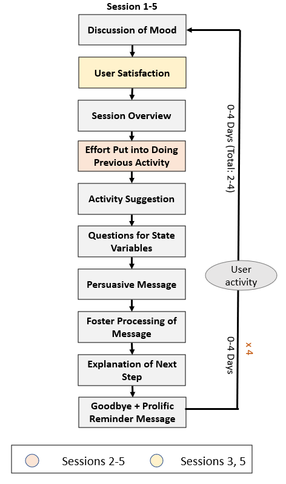

# ca_support_quit_smoking

This is the code for a conversational agent that suggests preparatory activities for smoking cessation and becoming more physically active in 5 separate sessions.

## Dialog Flow

